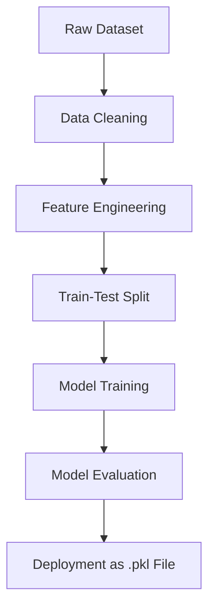

# Bengaluru House Price Prediction

This project involves predicting house prices in Bengaluru using a cleaned and preprocessed dataset, leveraging machine learning models for accurate predictions. The implementation focuses on data preprocessing, feature engineering, and applying regression models to achieve high prediction accuracy.

## Dataset Overview

- **Total Rows**: 13,320  
- **Columns**: 9  
- **Key Features**: `location`, `size`, `total_sqft`, `bath`, `price`  

### Data Cleaning and Preprocessing
- Handled missing values in:
  - `size`: Filled with **'2 BHK'**.
  - `bath`: Filled with the **median value of 2**.
- Reduced **1,260 unique locations** to **240 key categories** by grouping less frequent locations (occurrences <10) as "other".
- Engineered a new feature: **price per square foot**, calculated as:

  Price per square foot is calculated as:

Price per Sqft = Price × 100,000 / Total Sqft
Price per square foot is calculated by multiplying the property's price by 100,000 (to convert it into the same unit) and dividing the result by the total square footage of the property.
​
 
- Removed outliers:
  - Properties with less than **300 square feet per BHK**.
  - Price per square foot values outside **1 standard deviation**.

### Final Dataset
- **Cleaned Records**: 8,640  
- **Train-Test Split**: 80% training (10,656 records) and 20% testing (2,664 records).

## Models and Results

| Model              | R² Score |
|--------------------|-----------|
| Linear Regression  | 81.5%     |
| Lasso Regression   | 82.3%     |
| Ridge Regression   | **84.1%** |

The **Ridge Regression model** provided the best results and was saved for deployment.

## Pipeline Overview

1. **One-Hot Encoding**: Encoded categorical `location` into 240 features.
2. **Scaling**: Standardized numerical features for consistency.
3. **Regression**: Applied Ridge Regression for prediction.

## Project Workflow



## Deployment

- The final Ridge Regression model with **84.1% accuracy** was saved as a `.pkl` file for seamless deployment.

## Requirements

- Python 3.8+
- Libraries: `numpy`, `pandas`, `scikit-learn`, `pickle`

## How to Use

1. Clone this repository:
   ```bash
   git clone https://github.com/yourusername/bengaluru-house-price-prediction.git
   ```
2. Install dependencies:
   ```bash
   pip install -r requirements.txt
   ```
3. Run the preprocessing and training scripts to generate the model.
4. Use the `.pkl` file for predictions on new data.

## Results Visualization


- The scatter plot below shows actual vs. predicted prices:

  ```python
  import matplotlib.pyplot as plt
  plt.scatter(y_test, y_pred_ridge, alpha=0.5)
  plt.xlabel("Actual Prices")
  plt.ylabel("Predicted Prices")
  plt.title("Actual vs Predicted Prices")
  plt.show()
  ```

## Future Scope

- Incorporate additional features like amenities and age of the property.
- Experiment with advanced regression techniques (e.g., XGBoost, Random Forest).
- Create a web interface for real-time price prediction.

---

Feel free to contribute to this project by submitting issues or pull requests!
